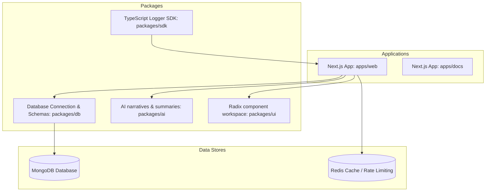
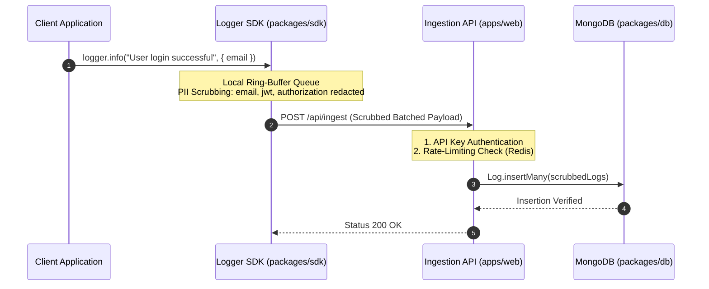
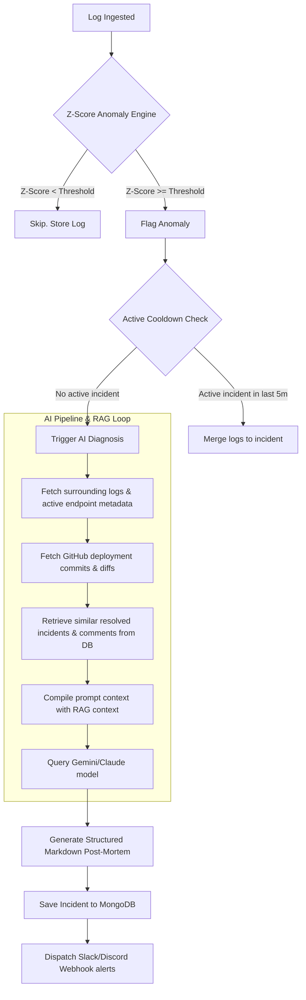

# System Architecture — ObservabilityOS

This document details the software architecture, package relationships, ingestion data pipelines, and anomaly detection loops of ObservabilityOS.

---

## 🏗️ Monorepo Package Topology

ObservabilityOS is managed as a monorepo workspace using **Turborepo**. The codebase separates visual presentation, data schemas, AI logic, and client SDKs into independent, compiled packages to enforce modularity and prevent dependency bloat.

---

## 📦 System Components & Packages

### 1. apps/docs

- Statically-rendered Next.js application that serves the customer-facing documentation, manuals, API specifications, and licensing terms.
- Implements custom markdown dynamic link-resolving compilation to cleanly adapt GitHub file trees to Next.js routes.
- Fully optimized with sitemaps, robots configurations, meta-descriptions, and structured JSON-LD schemas to support both search engines and AI web crawlers.

### 2. apps/web

- The core Next.js application that serves the frontend developer console (`/dashboard`) and REST APIs.
- Houses public telemetry ingestion APIs, GitHub OAuth handlers, payment processing webhooks, and SSE live log streaming channels.
- Configures Redis rate-limiting and JWT user session validation.

### 2. packages/db

- Shared data layer containing Mongoose models and database connection handlers.
- Defines schemas and indexes for: `Project`, `Service`, `Log`, `Incident`, `Metric`, and `AuditLog`.

### 3. packages/ai

- Interfaces with AI models (such as Gemini/Claude/GPT-4) using optimized prompt contexts.
- Formats unstructured log traces and deployment commit messages into readable incident post-mortems.

### 4. packages/sdk

- Zero-dependency client-side Winston/Pino-like logger SDK.
- Integrates a memory-buffered background ring-buffer queue to flush logs asynchronously, preventing request loop blocks in client applications.

---

## 🔌 Telemetry Ingestion Pipeline (Data Flow)

This diagram tracks the lifecycle of a log entry, from the client SDK invocation to persistent storage inside MongoDB, highlighting the local PII scrubbing process:

---

## 🚨 Anomaly Detection & AI Post-Mortem Loop

When error rates or response latencies breach statistical baselines, the anomaly loop triggers, diagnosing issues using deployment history and dispatching webhooks:

### Anomaly Z-Score Formula

The statistical anomaly detector calculates standard deviation spikes (Z-score) on historical baselines for error rates, latency, and CPU usage:

$$Z = \frac{x - \mu}{\sigma}$$

Where:

- $x$: Current metric value (e.g. error rate in the last 5 minutes).
- $\mu$: Historical baseline average (mean) over the last 12 windows (60 minutes).
- $\sigma$: Standard deviation of the baseline windows.
- If $Z \geq$ configured threshold (default `3.0`), the system triggers an anomaly alert.

## 🛡️ SRE Resilience & Self-Healing Architecture

ObservabilityOS is hardened against cascading failures and third-party dependencies outages:

### 1. Resilient Outbound Calls (Webhooks & AI APIs)

All outbound HTTP operations are wrapped inside a stateful **Circuit Breaker** and **Timeout** framework:

- **Timeouts**: Restricted to 3000ms for webhooks and 5000ms for AI provider requests to prevent thread blockages.
- **Failovers**: SRE pipeline automatically routes diagnostic calls through the AICredits gateway (failing over dynamically between the configured `AICREDITS_MODEL`, Claude 3.5 Haiku, and GPT-4o mini), then cascades to direct Anthropic Claude, OpenAI chat completions, and eventually to local mock heuristic models in case of severe outages.
- **Sandbox Protection**: Simulated playground/sandbox logs (prefixed with `trace_playground_` trace IDs) bypass outbound LLM requests entirely, falling back to local mock heuristic analysis to save API credits.
- **Plan-based Limits**: Projects on the Free Developer plan (`plan === "free"`) are restricted from consuming live LLM credits; calls automatically default to Mock Heuristics.
- **Circuit Breakers**: Outbound Slack/Discord webhook requests will trip to `OPEN` state after 3 consecutive failures, preventing event loop blockages.

### 2. Dual-Layer Caching (Redis Failover)

If the Redis cluster is offline, caching mechanisms (`getCache`, `setCache`) and rate limits drop back to local in-memory fallbacks:

- **In-Memory Cache**: Map-based local TTL cache.
- **In-Memory Rate Limiting**: Local sliding-window token bucket implementation.

### 3. Database Robustness

The MongoDB connection layer handles spikes and downtime gracefully:

- **Connection Pooling**: Configured with `maxPoolSize: 10` and `minPoolSize: 2` to manage resource limits.
- **Graceful Shutdown**: The process intercepts `SIGINT`/`SIGTERM` to cleanly disconnect all Mongoose sockets before exiting.

---

## 🔗 Related Documents

- 🔌 **[API.md](API.md)**: Full REST API specs for Ingest, Metrics, and Queries.
- 🗄️ **[DATABASE.md](DATABASE.md)**: Schemas, relationships, indexes, and cache key structures.
- 🛡️ **[SECURITY.md](SECURITY.md)**: Security boundaries and scrubbing regular expressions.
