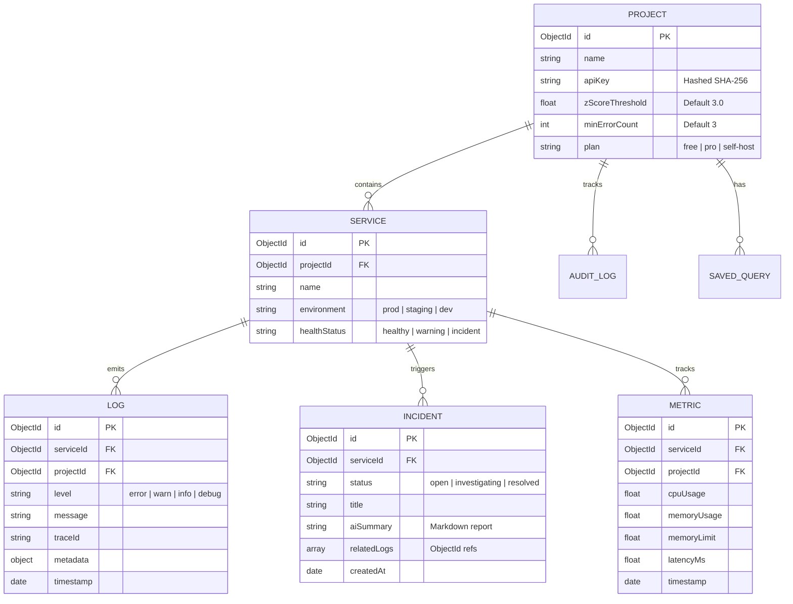

# Database Schema & Caching Reference — ObservabilityOS

ObservabilityOS utilizes **MongoDB** as its primary persistent database (managed via Mongoose) and **Redis** as a caching and sliding-window rate-limiting layer.

---

## 🗄️ MongoDB Database Schemas

All schemas are defined and shared inside the `@repo/db` package (located in `packages/db`).

---

## 🔍 MongoDB Indexes

To support fast log queries, metrics timeline rendering, and real-time anomaly calculation, we configure the following database indexes:

### 1. Log Collection

- **Compound Index (`projectId` + `serviceId` + `environment` + `level` + `timestamp` DESC)**:
  - Accelerates Z-score error counts, dashboard service feeds, and console log queries.
- **Trace Index (`traceId` ASC)**:
  - Speeds up tracing correlations across systems.

### 2. Metric Collection

- **Compound Time-Series Index (`projectId` + `serviceId` + `timestamp` DESC)**:
  - Used to query metrics for dashboard charts.

### 3. Project Collection

- **Unique Hashed Key Index (`apiKey` ASC)**:
  - Allows the ingestion API to verify API keys with $O(1)$ lookup time.

---

## ⚡ Redis Cache Schemas & Keys

We use Redis to cache heavy query aggregations, store API rate limit tracking windows, and stream live log events.

### 1. Dashboard Metrics Cache

To keep the dashboard loading speed under 100ms, aggregates like error rates and uptime metrics are cached:

- **Key Format**: `cache:project:<project_id>:metrics`
- **TTL (Expiration)**: 60 seconds.
- **Invalidation Trigger**: Automatically flushed whenever a new Z-Score anomaly is flagged or manual project settings are mutated.

### 2. Rate-Limiting Sliding Window

We implement atomic rate-limiting using Redis sliding-window pipelines:

- **Key Format**: `ratelimit:<ip_address>:<api_endpoint>` (or `ratelimit:<api_key>:ingest`)
- **TTL (Expiration)**: Dynamically set based on the rate-limit window configuration (e.g. 60 seconds).
- **Storage type**: Sorted Set (ZSET), storing timestamp integers as members and scores.

---

## 🔗 Related Documents

- 🏗️ **[ARCHITECTURE.md](ARCHITECTURE.md)**: Data flow pipelines.
- 🔌 **[API.md](API.md)**: API parameters corresponding to database fields.
- 🛠️ **[DEVELOPMENT.md](DEVELOPMENT.md)**: Testing commands for cascade deletion and database validation.
